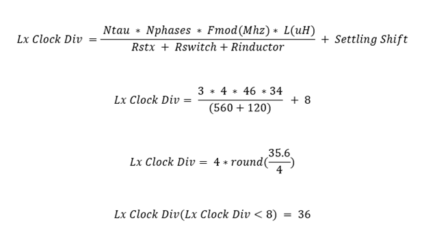

# PSOC&trade; 4: MSCLP Inductive Sensing Touch over Metal Keypad-2

This code example demonstrates the implementation of inductive sensing based Touch-over-Metal(ToM) keypad buttons. This low-power application showcases recommended power states and transitions and the tuning flow for inductive sensing based buttons. This example uses the multi sense Inductive&trade; sensing low-power technology (MSCLP - 5th-generation low-power Inductive&trade;) to demonstrate different considerations to implement a low-power design.


[View this README on GitHub.](https://github.com/Infineon/mtb-example-psoc4-msclp-isx-tom-keypad-2-buttons)

[Provide feedback on this code example.](https://cypress.co1.qualtrics.com/jfe/form/SV_1NTns53sK2yiljn?Q_EED=eyJVbmlxdWUgRG9jIElkIjoiQ0UyNDAxNDciLCJTcGVjIE51bWJlciI6IjAwMi00MDE0NyIsIkRvYyBUaXRsZSI6IlBTT0MmdHJhZGU7IDQ6IE1TQ0xQIEluZHVjdGl2ZSBTZW5zaW5nIFRvdWNoIG92ZXIgTWV0YWwgS2V5cGFkLTIiLCJyaWQiOiJqYWluc2lkaGFydGgiLCJEb2MgdmVyc2lvbiI6IjIuMC4wIiwiRG9jIExhbmd1YWdlIjoiRW5nbGlzaCIsIkRvYyBEaXZpc2lvbiI6Ik1DRCIsIkRvYyBCVSI6IklDVyIsIkRvYyBGYW1pbHkiOiJQU09DIn0=)


## Requirements

- [ModusToolbox&trade;](https://www.infineon.com/modustoolbox) v3.3 or later

> **Note:** This code example version requires ModusToolbox&trade; v3.3 and is not backward compatible with v3.2 or older versions.

- Board Support Package (BSP) minimum required version: 3.3.0
- Programming language: C
- Associated parts: [PSOC&trade; 4000T](https://www.infineon.com/002-33949)

## Supported toolchains (make variable 'TOOLCHAIN')

- GNU Arm&reg; Embedded Compiler v11.3.1 (`GCC_ARM`) – Default value of `TOOLCHAIN`
- Arm&reg; Compiler v6.22 (`ARM`)
- IAR C/C++ Compiler v9.50.2 (`IAR`)

## Supported kits (make variable 'TARGET')

- [PSOC&trade; 4000T CAPSENSE&trade; Multi-Sense Prototyping Kit](https://www.infineon.com/CY8CPROTO-040T-MS) (`CY8CPROTO-040T-MS`) - Default `TARGET`

## Hardware setup

This example uses the board's default configuration. See the [Kit user guide](https://www.infineon.com/002-40406) to ensure that the board is configured correctly to use VDD at 3.3 V.

## Software setup

See the [ModusToolbox&trade; tools package installation guide](https://www.infineon.com/ModusToolboxInstallguide) for information about installing and configuring the tools package.

This example requires [ModusToolbox™ CAPSENSE™ and Multi-Sense Pack](https://softwaretools.infineon.com/tools/com.ifx.tb.tool.modustoolboxpackmultisense) to be installed.

## Using the code example

### Create the project

The ModusToolbox&trade; tools package provides the Project Creator  both as a GUI tool and a command line tool.

<details><summary><b>Use Project Creator GUI</b></summary>

1. Open the Project Creator GUI tool.

   There are several ways to do this, including launching it from the dashboard or from inside the Eclipse IDE. For more details, see the [Project Creator user guide](https://www.infineon.com/ModusToolboxProjectCreator) (locally available at *{ModusToolbox&trade; install directory}/tools_{version}/project-creator/docs/project-creator.pdf*).

2. On the **Choose Board Support Package (BSP)** page, select a kit supported by this code example. See [Supported kits](#supported-kits-make-variable-target).

   > **Note:** To use this code example for a kit not listed here, you may need to update the source files. If the kit does not have the required resources, the application may not work.

3. On the **Select Application** page:

   a. Select the **Applications(s) Root Path** and the **Target IDE**.

   > **Note:** Depending on how you open the Project Creator tool, these fields may be pre-selected for you.

   b.	Select this code example from the list by enabling its check box.

   > **Note:** You can narrow the list of displayed examples by typing in the filter box.

   c. (Optional) Change the suggested **New Application Name** and **New BSP Name**.

   d. Click **Create** to complete the application creation process.

</details>

<details><summary><b>Use Project Creator CLI</b></summary>

The 'project-creator-cli' tool can be used to create applications from a CLI terminal or from within batch files or shell scripts. This tool is available in the *{ModusToolbox&trade; install directory}/tools_{version}/project-creator/* directory.

Use a CLI terminal to invoke the 'project-creator-cli' tool. On Windows, use the command-line 'modus-shell' program provided in the ModusToolbox&trade; installation instead of a standard Windows command-line application. This shell provides access to all ModusToolbox&trade; tools. You can access it by typing "modus-shell" in the search box in the Windows menu. In Linux and macOS, you can use any terminal application.

The following example clones the "[mtb-example-msclp-isx-tom-keypad-4-buttons-demo](https://github.com/Infineon/mtb-example-cy8cproto-040t-demo)" application with the desired name "CY8CPROTO_040T_MS_demo" configured for the *CY8CPROTO-040T* BSP into the specified working directory, *C:/mtb_projects*:

   ```
   project-creator-cli --board-id CY8CPROTO-040T-MS --app-id mtb-example-msclp-isx-tom-keypad-4-buttons-demo --user-app-name CY8CPROTO_040T_MS_demo --target-dir "C:/mtb_projects"
   ```

The 'project-creator-cli' tool has the following arguments:

Argument | Description | Required/optional
---------|-------------|-----------
`--board-id` | Defined in the <id> field of the [BSP](https://github.com/Infineon?q=bsp-manifest&type=&language=&sort=) manifest | Required
`--app-id`   | Defined in the <id> field of the [CE](https://github.com/Infineon?q=ce-manifest&type=&language=&sort=) manifest | Required
`--target-dir`| Specify the directory in which the application is to be created if you prefer not to use the default current working directory | Optional
`--user-app-name`| Specify the name of the application if you prefer to have a name other than the example's default name | Optional

> **Note:** The project-creator-cli tool uses the `git clone` and `make getlibs` commands to fetch the repository and import the required libraries. For details, see the "Project Creator tools" section of the [ModusToolbox&trade; tools package user guide](https://www.infineon.com/ModusToolboxUserGuide) (locally available at {ModusToolbox&trade; install directory}/docs_{version}/mtb_user_guide.pdf).

</details>


### Open the project

After the project has been created, you can open it in your preferred development environment.


<details><summary><b>Eclipse IDE</b></summary>

If you opened the Project Creator tool from the included Eclipse IDE, the project will open in Eclipse automatically.

For more details, see the [Eclipse IDE for ModusToolbox&trade; user guide](https://www.infineon.com/MTBEclipseIDEUserGuide) (locally available at *{ModusToolbox&trade; install directory}/docs_{version}/mt_ide_user_guide.pdf*).

</details>


<details><summary><b>Visual Studio (VS) Code</b></summary>

Launch VS Code manually, and then open the generated *{project-name}.code-workspace* file located in the project directory.

For more details, see the [Visual Studio Code for ModusToolbox&trade; user guide](https://www.infineon.com/MTBVSCodeUserGuide) (locally available at *{ModusToolbox&trade; install directory}/docs_{version}/mt_vscode_user_guide.pdf*).

</details>


<details><summary><b>Keil µVision</b></summary>

Double-click the generated *{project-name}.cprj* file to launch the Keil µVision IDE.

For more details, see the [Keil µVision for ModusToolbox&trade; user guide](https://www.infineon.com/MTBuVisionUserGuide) (locally available at *{ModusToolbox&trade; install directory}/docs_{version}/mt_uvision_user_guide.pdf*).

</details>


<details><summary><b>IAR Embedded Workbench</b></summary>

Open IAR Embedded Workbench manually, and create a new project. Then select the generated *{project-name}.ipcf* file located in the project directory.

For more details, see the [IAR Embedded Workbench for ModusToolbox&trade; user guide](https://www.infineon.com/MTBIARUserGuide) (locally available at *{ModusToolbox&trade; install directory}/docs_{version}/mt_iar_user_guide.pdf*).

</details>


<details><summary><b>Command line</b></summary>

If you prefer to use the CLI, open the appropriate terminal, and navigate to the project directory. On Windows, use the command-line 'modus-shell' program; on Linux and macOS, you can use any terminal application. From there, you can run various `make` commands.

For more details, see the [ModusToolbox&trade; tools package user guide](https://www.infineon.com/ModusToolboxUserGuide) (locally available at *{ModusToolbox&trade; install directory}/docs_{version}/mtb_user_guide.pdf*).

</details>


## Operation

1. Connect the USB cable between the [CY8CPROTO-040T-MS Kit](https://www.infineon.com/CY8CPROTO-040T-MS) and the PC with the Keypad-2 extension board, as shown in **Figure 1**.

   **Figure 1. Connecting the CY8CPROTO-040T-MS Kit with the PC**

   

2. Program the board using one of the following:

   <details><summary><b>Using Eclipse IDE</b></summary>

      1. Select the application project in the Project Explorer.

      2. In the **Quick Panel**, scroll down, and click **\<Application Name> Program (KitProg3_MiniProg4)**.
   </details>


   <details><summary><b>In other IDEs</b></summary>

   Follow the instructions in your preferred IDE.
   </details>


   <details><summary><b>Using CLI</b></summary>

     From the terminal, execute the `make program` command to build and program the application using the default toolchain to the default target. The default toolchain is specified in the application's Makefile but you can override this value manually:
      ```
      make program TOOLCHAIN=<toolchain>
      ```

      Example:
      ```
      make program TOOLCHAIN=GCC_ARM
      ```
   </details>

3. After programming, the application starts automatically.

> **Note:** After programming, you will see the following error message if the Debug mode is disabled. This can be ignored, or enabling debug will solve this error.<br>

   ``` c
   "Error: Error connecting Dp: Cannot read IDR"
   ```

4. Press any of the sensors with your finger; LEDs turn ON, indicating the activation of different Inductive Sensing based sensors as shown in **Figure 2**.

   **Figure 2. Pressing the CY8CPROTO-040T-MS Kit with the PC**

   

   **Table 1. LED states for different sensors**

    Sensor pressed | LED indication
   :---------------------| :-----
    ISX button 0  | LED 0 turns ON
    ISX button 1  | LED 1 turns ON
    
    <br>

   All LEDs will be OFF when none of the sensor buttons are pressed.

### Monitor data using CAPSENSE&trade; Tuner


1. Open the CAPSENSE&trade; Tuner from the **Tools** section in the IDE Quick Panel.

   You can also run the CAPSENSE&trade; tuner application standalone from *{ModusToolbox&trade; install directory}/ModusToolbox/tools_{version}/capsense-configurator/capsense-tuner*. In this case, after opening the application, select **File** > **Open** and then open the *design.cycapsense* file of the respective application, which is present in the *{Application root directory}/bsps/TARGET_APP_\<BSP-NAME>/config* folder.

   See the [ModusToolbox&trade; user guide](https://www.infineon.com/ModusToolboxUserGuide) (locally available at *{ModusToolbox install directory}/docs_{version}/mtb_user_guide.pdf*) for options to open the CAPSENSE&trade; tuner application using the CLI.

2. Ensure that the status LED is ON and not blinking; this indicates that the onboard KitProg3 is in CMSIS-DAP Bulk mode. See the [Firmware-loader](https://github.com/Infineon/Firmware-loader) to learn how to update the firmware and switch modes in KitProg3.

3. In the tuner application, click on the **Tuner Communication Setup** icon or select **Tools** > **Tuner Communication Setup** as shown in **Figure 3**.

   **Figure 3. Tuner communication setup**

    

   Select I2C under KitProg3 and configure it as follows:

   - I2C address: 8
   - Sub-address: 2 bytes
   - Speed (kHz): 400

   These are the same values set in the EZI2C resource as shown in **Figure 4**.

   **Figure 4. Tuner Communication Setup parameters**

   

4. Click **Connect** or select **Communication** > **Connect** to establish a connection.

   **Figure 5. Establish connection**

   

5. Click **Start** or select **Communication** > **Start** to begin data streaming from the device.

   **Figure 6. Start Tuner communication**

   

   The **Widget/Sensor Parameters** tab is updated with the parameters configured in the *CAPSENSE&trade; Configurator* window. The tuner displays the data from the sensor in the **Widget View** and **Graph View** tabs.

6. Set the **Read mode** to **Synchronized mode**. Navigate to the **Widget view** tab and notice that the pressed widget is highlighted in **blue** as shown in **Figure 7**.

   **Figure 7. Widget view of the CAPSENSE&trade; Tuner**

   

7. Go to the **Graph View** tab to view the raw count, baseline, difference count, and status of each sensor.
To view the sensor data for the different ISX buttons, select Button0_Rx0_Lx0 under Button0 and so on, respectively (see **Figure 8** ).

   **Figure 8. Graph view of the CAPSENSE&trade; Tuner for the ISX button**

   

8. Observe that the low-power widget sensor (**LowPower0_Rx0_Lx0**) raw count is plotted after the device completes the full frame scan (or detects a press) in **WoT** mode and moves to **Active/ALR** mode.

   **Figure 9. Graph view of the CAPSENSE&trade; Tuner for the low-power widget**

   

8. See **Widget/Sensor parameters** section in the CAPSENSE&trade; Tuner window as shown in Figure 7.

9. Switch to the **SNR Measurement** tab for measuring the SNR and verify that the SNR is greater than 10:1, and the signal count is above 50; select **Button0** and **Button0_Rx0_Lx0** sensor, and then click **Acquire noise** as shown in Figure 10.

    **Figure 10. CAPSENSE&trade; Tuner - SNR measurement: Acquire noise**

    
    
    <br>

      >**Note:** Because the scan refresh rate is lower in **ALR** and **WoT** mode, it takes more time to acquire noise. Press the ISX button on the Keypad-2 extension board before clicking **Acquire noise** to transition the device to Active mode to receive the signal faster.
    
    <br>
10. Once the noise is acquired, place the finger at a position on the button and then click **Acquire signal**. Ensure that the finger remains on the button as long as the signal acquisition is in progress. Observe that the SNR is greater than 10:1 and the signal count is above '50'.

    The calculated SNR on this button is displayed, as shown in Figure 11. Based on the end system design, test the signal with a finger press force that matches the size of normal use case. Also, test using lighter presses that will be rejected by the system to ensure that they do not reach the finger threshold.

    **Figure 11. CAPSENSE&trade; Tuner - SNR measurement: Acquire signal**

    
    
    <br>
11. To measure the SNR of the low-power sensor (**LowPower0_Rx0_Lx0**), set the **Finger threshold** to max (65535) in **Widget/Sensor Parameters** as shown in **Figure 12** for all widgets. This is required to stop detecting a touch in low-power mode and ALR mode and to avoid state transitions to Active mode from both low-power mode and ALR mode.
Use the **Apply to Device** option to set the modified parameters to the device instantaneously. But make the final configuration using the CAPSENSE&trade; Configurator.

      **Figure 12. CAPSENSE&trade; update finger threshold**

       

      **Figure 13. Apply changes to device**

      

   <br>

12. Repeat **steps 10 and 11** to observe the SNR and signal count as shown in Figure 14.

    **Figure 14. CAPSENSE&trade; Tuner - SNR measurement: low-power widget**

    

   <br>

 
## Operation at other voltages

[CY8CPROTO-040T-MS Kit](https://www.infineon.com/CY8CPROTO-040T-MS) supports operating voltages of 1.8 V, 3.3 V and 5 V. See the [Kit user guide](https://www.infineon.com/002-40406) to set the preferred operating voltage and refer to the section [Setup the VDDA supply voltage and Debug mode](#set-up-the-vdda-supply-voltage-and-debug-mode-in-device-configurator).

The functionalities of this application is optimally tuned for 3.3 V. Observe that the basic functionalities work across other voltages.

For better performance, it is recommended to tune the application to use the preferred voltages. 

## Tuning procedure

<details><summary><b>Create custom BSP for your board</b></summary>

1. Follow the steps shown in [ModusToolbox&trade; BSP Assistant user guide](https://www.infineon.com/dgdl/Infineon-ModusToolbox_BSP_Assistant_1.0_User_Guide-UserManual-v02_00-EN.pdf?fileId=8ac78c8c8386267f0183a972f45c59af) to create a custom BSP for your board having any device. In this code example, it is created for the **CY8C4046LQI-T452** device.

2. Open the *design.modus* file from *{Application root directory}/bsps/TARGET_APP_\<BSP-NAME>/config* folder obtained in the previous step and enable CAPSENSE&trade; to get the *design.cycapsense* file. CAPSENSE&trade; configuration can then be started from scratch as follows.
</details>

<br>

> **Note:** See the section "Tuning the inductive-sensing solution" in the [AN239751 Flyback inductive sensing (ISX) design guide](https://www.infineon.com/AN239751) and the "Selecting CAPSENSE&trade; hardware parameters" in [AN85951 – PSOC&trade; 4  design guide](https://www.infineon.com/AN85951) to learn about the considerations for selecting each parameter value. In addition, see the section "Low-power Widget parameters" in [AN234231 – Achieving lowest power capacitive sensing with PSOC&trade; 4000T](https://www.infineon.com/AN234231) for more details about the considerations for parameter values specific to low-power widgets.


**Figure 20. Low-power widget tuning flow**


###### Do the following to tune the button widget:

- [Stage 1: Set the initial hardware parameters](#stage-1-set-the-initial-hardware-parameters)

- [Stage 2: Set the Lx clock divider](#stage-2-set-the-lx-clock-divider)

- [Stage 3: Fine tune for the required SNR, power, and refresh rate](#stage-3-fine-tune-for-required-snr-power-and-refresh-rate)

- [Stage 4: Tune threshold parameters](#stage-4-tune-threshold-parameters)

### **Stage 1: Set the initial hardware parameters**
-------------

1. Connect the board to the PC using the provided USB cable through the KitProg3 USB connector.

2. Launch the **Device Configurator** tool.

   Launch the Device Configurator in Eclipse IDE for ModusToolbox&trade; from the Tools section in the IDE Quick Panel or Standalone mode from the *{ModusToolbox&trade; install directory}/ModusToolbox/tools_{version}/device-configurator/device-configurator*. In this case, after opening the application, select **File** > **Open** and open the *design.modus* file of the respective application, which is present in the *{Application root directory}/bsps/TARGET_APP_\<BSP-NAME>/config* folder.

3. Enable the CAPSENSE&trade; channel in **Device Configurator** as shown in the Figure 21 and save the changes.

   **Figure 21. Enable CAPSENSE&trade; in Device Configurator**

   

  <br>

4. Launch the **CAPSENSE&trade; Configurator** tool.

    To launch the Configurator tool in Eclipse IDE for ModusToolbox&trade; from the "CAPSENSE&trade;" peripheral setting in the Device Configurator or directly from the Tools section in the IDE Quick Panel.

   The tool is launched in a Standalone mode from *{ModusToolbox&trade; install directory}/ModusToolbox/tools_{version}/capsense-configurator/capsense-configurator*. In this case, after opening the application, select **File** > **Open** and open the *design.cycapsense* file of the respective application, which is present in the *{Application root directory}/bsps/TARGET_APP_\<BSP-NAME>/config* folder.

   See the [ModusToolbox&trade; CAPSENSE&trade; Configurator user guide](https://www.infineon.com/ModusToolboxCapSenseConfig) for step-by-step instructions to configure and launch CAPSENSE&trade; in ModusToolbox&trade;.

5. In the **Basic** tab, configure the Button widgets and low-power widgets as ISX-RM as shown in the Figure 22 below.

   **Figure 22. CAPSENSE&trade; Configurator - basic tab**

   

   <br>

6. Do the following in the **General** tab under the **Advanced** tab:
   <ol type="A">
   <li>

   Select **CAPSENSE&trade; IMO Clock frequency** as **46 MHz**. 
   </li>

   <li>

   Set the **Modulator clock divider** to **1** to obtain the maximum available modulator clock frequency.
   </li>

   <li>

   Set the **Number of init sub-conversions** based on the hint shown when you hover over the edit box. Retain the default value.
   </li>

   <li>

   Use **Wake-on-Touch settings** to set the refresh rate and frame timeout while in the lowest power mode (Wake-on-Touch mode). Set **Wake-on-Touch scan interval (µs)** based on the required low-power state scan refresh rate. For example, to get a 16-Hz refresh rate, set the value to **62500**. 
   </li>


   <li>

   Set the **Number of frames in Wake-on-Touch** as the maximum number of frames to be scanned in WoT mode if there is no touch detected. This determines the maximum time the device will be kept in the lowest-power mode if there is no user activity. Calculate the maximum time by multiplying this parameter with the **Wake-on-Touch scan interval (µs)** value.

   For example, to get 10 s as the maximum time in WoT mode, set the **Number of frames in Wake-on-Touch** to **160** for the  scan interval set as 62500 µs.

   >**Note:** For tuning low-power widgets, the **Number of frames in Wake-on-Touch** must be less than the  **Maximum number of raw counts in SRAM** based on the number of sensors in WoT mode as shown in Table 3.

   **Table 3. Maximum number of raw counts in SRAM**

   Number of low <br> power widgets  | Maximum number of <br> raw counts in SRAM
      :---------------------| :-----
      1  | 245
      2  | 117
      3  | 74
      4  | 53
      5  | 40
      6  | 31
      7  | 25
      8  | 21
      
   **Figure 23. CAPSENSE&trade; Configurator – general settings**

   
   
   </li>
   <li>

   Retain the default settings for all regular and low-power widget filters. To enable or update the filters later depending on the SNR requirements in [Stage 3: Fine tune for required SNR, power, and refresh rate](#stage-3-fine-tune-for-required-snr-power-and-refresh-rate).The filters reduce the peak-to-peak noise, and using software filters results in a higher scan time.
      
   </li>
   </ol>
   
   <br>

    >**Note:** Each tab has a **Restore Defaults** button to restore the parameters of that tab to their default values.

    <br>

7. Go to the **ISX settings** tab and make the following changes:
   <ol type="A">
      <li>

      **Raw count calibration level(%)** helps to achieve the required CDAC calibration levels (35% of maximum count by default) for all sensors in the widget, while maintaining the same sensitivity across the sensor elements.
    


      **Figure 24. CAPSENSE&trade; Configurator - advanced CSD settings**

      
      </li>
      
      <br>

8. Go to the **Advanced** > **Widget Details** tab. Select **LowPower0** from the left pane, and then set the following:

   - **Sense clock divider**: Retain the default value (this will be set in [Stage 2: Set the Lx Clock Divider](#stage-2-set-the-lx-clock-divider))

   - **Clock source**: Direct

   - **Number of sub-conversions**: 60

     '60'is a good starting point to ensure a fast scan time and sufficient signal. This value is adjusted as required in [Stage 3: Fine tune for required SNR, power, and refresh rate](#stage-3-fine-tune-for-required-snr-power-and-refresh-rate).

   - **Finger threshold**: 65535

     Finger threshold is set to maximum to avoid waking up the device from the WoT mode due to touch detection; this is required to find the signal and SNR. 

   - **Noise threshold**: 10

   - **Negative noise threshold**: 10

   - **Low baseline reset**: 10

   - **ON debounce**: 3

     These threshold values reduce the influence of the baseline on the sensor signal, which helps to get the true difference count. These parameters are set in [Stage 4: Tune threshold parameters](#stage-4-tune-threshold-parameters).

      Next, select the other widgets from the left pane, and repeat the same configuration for that sensor as well.

      **Figure 25. CAPSENSE&trade; Configurator – Widget Details tab**

     
     
     <br>

9. Go to the **Scan Configuration** tab to select the pins and the scan slots. Do the following:

      A. Configure pins for the electrodes using the drop-down menu.

      B. Configure the scan slots using the **Auto-assign slots** option. The other option is to allot each sensor a scan slot-based on the entered slot number.

      C. Check the notice list for warnings or errors.

      **Figure 26. Scan configuration tab**

      

      <br>

10. Click **Save** to apply the settings.


### **Stage 2: Set the Lx Clock Divider**
------------------
The Lx clock is derived from the modulator clock using a clock-divider and is used to scan the sensor. The Lx clock divider should be configured such that the pulse width of the sense clock is long enough to allow the sensor inductance to accumulate its energy completely while preventing prolonged charging which will waste scan time. This is verified by observing the current waveforms of the sensor series resistance Rtx, using an oscilloscope and active probes.

Follow the steps as below to obtain the Lx Clock Divider value-

1. Find the expected/approximate value of the Lx Clock Divider using the following equation-

**Equation 1. Lx Clock Divider Equation**

   


   Here,
   - Lx clock divider: Approximate value is obtained

   - $N_{tau}$: Settling constant. Set to 3 by default.

   - $Nphases$: Number of scan phases. Set to 4. 

   - $F_{mod}(MHz)$: Modulator Clock Frequency in MHz. In this example, this is 46 MHz.

   - $L(uH)$: Obtain the inductance value using a LCR meter. For the buttons in this example, the value is around 34 uH.

   - $R_{stx}/R_{ext}$: The Tx resistor in series. 560 ohms in this kit.

   - $R_{switch}/R_{int}$: Internal switch resistance. The default value can be set as 100 ohms.

   - $Rinductor$: This value can be obtained using the LCR meter while obtaining the inductance value. It must be included when sensor is larger and can contribute to the total resistance value significantly.

   - Settling Shift: Provide a shift to consider actual settling time. Default value is 8. This can be changed based on oscilloscope observations.
   
   This value serves only as a starting point for your measurements. Set this value in the CAPSENSE&trade; configurator as shown in the figure. Program the board.
    
   > **Note:** The Lx clock divider should be **divisible by 4**. This ensures that all four scan phases have equal durations.
   
2. Probe the Rtx resistor on both sides as shown in the figure. Then perform a math function on the oscilloscope to obtain the approximate current flowing through the resistor.

    Calculate M1 = (Ch4 - Ch3) / Rstx
    On this kit the value of Rstx is 560 ohms.
   
   **Figure 27. Probing the series resistor**

   

3. As shown in the figures below-

   a. Ensure that the charging and discharging for the inductance is not incomplete. If so, increase the Lx Clock Divider.

   b. Ensure that the inductance is not charging and discharging for a prolonged time. If so, decrease the Lx Clock Divider.
   
 The Figure 28 and Figure 29 below show the two cases.


**Figure 28. Improper charge cycle of a sensor with incomplete cycles**


**Figure 29. Improper charge cycle of a sensor with prolonged cycles**


Obtain the Lx Clock Divider value where the charging and discharging are just completed as shown in the Figure 30 below. 

**Figure 30. Correct charge cycle of a sensor**


5. Repeat this process for all the sensors. Each sensor might require a different Lx clock divider value to charge/discharge completely.


### **Stage 3: Fine-tune for required SNR, power, and refresh rate**
-----------------------

The sensor should be tuned to have a minimum SNR of 10:1 and a minimum signal of 50 to ensure reliable operation. The sensitivity can be increased by increasing number of sub-conversions and noise can be decreased by enabling filters. 

The steps for optimizing these parameters are as follows:

1. Find the number of sub-conversions for each widget based on your Lx Clock Divider and scan time values (800 µs in this example).

   $N_{sub}$ = $floor (Scan time * Lx Clock Frequency)$
   
   where,

   $Lx Clock Frequency$ = $F_{mod}$ (MHz) / Lx Clock Divider

   $F_{mod}$ (MHz) = 46 MHz (default)

2. Measure the SNR as mentioned in the [Operation](#operation) section.

3. If the SNR is less than 10:1 increase the number of sub-conversions.  Edit the number of sub-conversions ($N_{sub}$) directly in the **Widget/Sensor parameters** tab of the CAPSENSE&trade; tuner.

      >**Note:** Number of sub-conversion should be greater than or equal to 8.

3. Load the parameters to the device and measure SNR as mentioned in Steps 10 and 11 in the [Monitor data using the Tuner](#monitor-data-using-the-tuner) section. 
   
      Repeat steps 1 to 3 until the following conditions are met:
      - Measured SNR from the previous stage is greater than 10:1
      - Signal count is greater than 50

4. If the system is noisy (> 40% of signal), enable the filters.

   This example has the CIC2 filter enabled, which increases the resolution for the same scan time. See [AN234231 - Achieving lowest-power capacitive sensing with PSOC&trade; 4000T](https://www.infineon.com/AN234231) for detailed information on the CIC2 filter. Whenever CIC2 filter is enabled, it is recommended to enable the IIR filter for optimal noise reduction. Therefore this example has the IIR filter enabled as well.
   <ol type="A">
   <li>

   Open **CAPSENSE&trade; Configurator** from ModusToolbox&trade; Quick Panel and select the appropriate filter as shown in **Figure 31**.

   **Figure 31. Filter settings in CAPSENSE&trade; Configurator**

   
   </li>
   <li>
   
   Enable the filter based on the type of noise in your system. See [AN239751 - Flyback Inductive Sensing Design Guide](https://www.infineon.com/AN239751) and [AN85951 – PSOC&trade; 4 and PSOC&trade; 6 MCU CAPSENSE&trade; design guide](https://www.infineon.com/AN85951) for more details.
   </li>
   <li>

   Click Save and program the device to update the filter settings.
   </li>

   >**Note** : Increasing the number of sub-conversions and enabling filters will increase the scan time which in turn decreasing the responsiveness of the sensor. Increase in scan time also increases the power consumption. Therefore, the number of sub-conversions and filter configuration must be optimized to achieve a balance between SNR, power, and refresh rate. 


### **Stage 4: Tune threshold parameters**
--------------------

Various thresholds, relative to the signal, need to be set for each sensor. Do the following in CAPSENSE&trade; tuner to set up the thresholds for a widget:

1. Switch to the **Graph View** tab and select **Button0**.

2. Touch the sensor and monitor the touch signal in the **Sensor signal** graph, as shown in Figure 32. 

   **Figure 32. Sensor signal when the sensor is touched**

   

   <br>

3. Note the signal measured and set the thresholds according to the following recommendations:

   - Finger threshold = 80% of the signal

   - Noise threshold = 40% of the signal

   - Negative noise threshold = 40% of the signal

   - Hysteresis = 10% of signal

   - Debounce = 3

4. Set the threshold parameters in the **Widget/Sensor parameters** section of the CAPSENSE&trade; Tuner:

   **Figure 33. Widget threshold parameters**

   

   <br>
   
   **Table 4. Sensor tuning parameters obtained for CY8CPROTO-040T-MS for Button0**

   Parameter|	 Button0|	 LowPower0
   :--------|:------|:------
   Signal	| 250 | 160
   Finger threshold 	| 200 |100
   Noise threshold |100|40
   Negative noise threshold	|100 |40
   Low baseline reset	| 30 |30
   Hysteresis	| 25 |NA
   ON debounce	| 3|3

5. For the **LowPower0_Sns0** low power sensor, first configure the finger threshold to '65535' and wait for the application to enter Low-power mode. Since the finger threshold is set to maximum, touching the low-power button will not switch the application to Active mode. 
Repeat step 2 to 4 for the low-power button.

6. Apply the settings to the device by clicking **Apply to Device**.

   **Figure 34. Apply settings to device**

   

   <br>

   After applying the configuration test the performance by touching the button. If your sensor is tuned correctly, you will observe the touch status go from 0 to 1 in the **Status** panel of the **Graph View** tab as shown in Figure 35. The status of the button is also indicated by LED1 in the kit; LED1 turns ON when the finger touches the button and turns OFF when the finger is removed.

   **Figure 35. Sensor status in CAPSENSE&trade; Tuner**

   

   <br>

7. Click **Apply to Project** as shown in **Figure 36**. The change is updated in the *design.cycapsense* file. Close **CAPSENSE&trade; Tuner** and launch **CAPSENSE&trade; Configurator**. All the changes in the CAPSENSE&trade; Tuner reflects in the **CAPSENSE&trade; Configurator**.

   **Figure 36. Apply settings to Project**

   

   <br>


###  **Process time measurement**
--------------------


To set the optimum refresh rate of each power mode, we need to measure the process time of our application.

Follow these steps to measure the process time of the blocks of application code, while excluding the scan time.

1. Enable ENABLE_RUN_TIME_MEASUREMENT macro in main.c as follows:
      
      ```
      #define ENABLE_RUN_TIME_MEASUREMENT (1u)
      ```     
      This macro enables the System tick configuration and runtime measurement functionalities. 

2.	Place the start_runtime_measurement() function call before your application code and the stop_runtime_measurement() function call after it. The stop_runtime_measurement() function will return the execution time in microseconds(µs). 
 
      ```   
         #if ENABLE_RUN_TIME_MEASUREMENT
            uint32_t run_time = 0;
            start_runtime_measurement();
         #endif

         /* User Application Code Start */
         .
         .
         .
         /* User Application Code Stop */

         #if ENABLE_RUN_TIME_MEASUREMENT
            run_time = stop_runtime_measurement();
         #endif
      ```

3.	Run the application in Debug mode with breakpoints placed at the active_processing_time and alr_processing_time variables as follows:
      ```
         #if ENABLE_RUN_TIME_MEASUREMENT
            active_processing_time=stop_runtime_measurement();
         #endif
         and 
         #if ENABLE_RUN_TIME_MEASUREMENT
            alr_processing_time=stop_runtime_measurement();
         #endif
      ``` 
4. Read the variables by adding them into Expressions view tab.
5. Update related macros with above measured processing times in main.c as follows:
      ```
      #define ACTIVE_MODE_PROCESS_TIME     (xx)

      #define ALR_MODE_PROCESS_TIME        (xx)
      ```
### **Scan time measurement**
--------------------
The scan time is also required for calculating the refresh rate of the application power modes. The total scan time of all the widgets in this code example is 16 µs.

It can be calculated as follows:

   - The scan time includes the MSCLP initialization time, Cmod, and the total sub-conversions of the sensor. 

   - To control the Cmod initialization sequence, set the "Enable Coarse initialization bypass" configurator option as listed in the following table:
   **Table 5. Enable coarse initialization bypass**

   Enable coarse initialization bypass | Behaviour
   :-------------|:---------
   TRUE|Cmod initialization happens only once before scanning the sensors of the widget
   FALSE| Cmod initialization happens before scanning each sensor of the widget

Use the following equations to measure the widgets scan time based on coarse initialization bypass options selected: 

- **Equation 2. Scan time calculation of a widget with coarse initialization bypass enabled**

  

- **Equation 3. Scan time calculation of a widget with coarse initialization bypass disabled**

  


where,

$n$ - Total number of sensors in the widget

$N_{init}$ - Number of init sub-conversions

$N_{sub}$ - Number of sub-conversions

$SnsClkDiv$ - The Lx clock divider for the widget

$F_{mod}$ - Modulator clock frequency

$k$ - Measured Initialization time (MSCLP+Cmod).

This value of $k$ measured for this application is ~10 µs. It remains constant for all widgets. 

The value of **$k$** can be measured using oscilloscope as shown in Figure 37.

 **Figure 37. $k$ value measurement**

   

Update the following macros in *main.c* using the scan time calculated. The value remains the same for both macros for this application.

```
#define ACTIVE_MODE_FRAME_SCAN_TIME     (xx)

#define ALR_MODE_FRAME_SCAN_TIME        (xx)
```


>**Note:** If the application has more than one widget, add the scan times of individual widgets calculated.

## Debugging

You can debug the example to step through the code.

<details><summary><b>In Eclipse IDE</b></summary>

Use the **\<Application Name> Debug (KitProg3_MiniProg4)** configuration in the **Quick Panel**. For more details, see the "Program and debug" section in the [Eclipse IDE for ModusToolbox&trade; user guide](https://www.infineon.com/MTBEclipseIDEUserGuide).

</details>


<details><summary><b>In other IDEs</b></summary>

Follow the instructions in your preferred IDE.
</details>


## Design and implementation

The design has a ratiometric implementation of the following sensors:
1. Two Wake-on-Touch widget (2 elements), also called "Low-power Widget"
2. Two inductive sensing based button widgets (2 elements)

Following are the four LEDs used in this project: 
- LEDs 0 to 1 show the buttons' touch status: They are turned ON when the corresponding button is pressed and turned OFF when the finger is lifted. 

There are three power states defined for this project:

- Active mode

- Active-low refresh rate (**ALR**) mode

- Wake-on-Touch (**WoT**) mode

After reset, the device is in Active mode, and scans the regular CAPSENSE&trade; widgets with a high refresh rate (**128 Hz**). If user activity is detected in any other mode, the device is transferred to Active mode to provide the best user interface experience. This mode has the highest power consumption; therefore, the design should reduce the time spent in Active mode.

If there is no user activity for a certain period of time (`ACTIVE_MODE_TIMEOUT_SEC` = 10 s), the application transitions to ALR mode. Here, the refresh rate is reduced to **32 Hz**; and hence this mode acts as an intermediate state before moving to the lowest-power mode (WoT mode). This mode can also be used for periodically updating the baselines of sensors while there is no user activity for a long time.

Further non-activity for a certain time span (`ALR_MODE_TIMEOUT_SEC` = 5 s) transitions the application to the lowest-power mode, called the **Wake-on-Touch** mode, which scans the low-power widget at a low refresh rate (**16 Hz**) and processes the results without CPU intervention.

> **Note:** An internal low-power timer (MSCLP timer) is available in CAPSENSE&trade; MSCLP hardware to set the refresh rate for each power mode as follows:

- For Active and ALR modes: Use the `Cy_CapSense_ConfigureMsclpTimer()` function
- For WoT mode: Use the Wake-on-Touch scan interval in CAPSENSE&trade; configurator

Different power modes and transition conditions for a typical use case are shown in **Figure 38**.

   **Figure 38. State machine showing different power states of the device**

   


The project uses the [CAPSENSE&trade; middleware](https://github.com/Infineon/capsense) (see ModusToolbox&trade; user guide for more details on selecting a middleware). See [AN85951 – PSOC&trade; 4 design guide](https://www.infineon.com/AN85951) and [AN239751](https://www.infineon.com/AN239751) - Flyback Inductive Sensing Design Guide for more details on CAPSENSE&trade; features and usage.

The [ModusToolbox&trade;](https://www.infineon.com/modustoolbox) provides a GUI-based tuner application for debugging and tuning the CAPSENSE&trade; system. The CAPSENSE&trade; tuner application works with EZI2C and UART communication interfaces. This project has an SCB block configured in EZI2C mode to establish communication with the onboard KitProg, which in turn enables reading the CAPSENSE&trade; raw data using the CAPSENSE&trade; Tuner. See [EZI2C Peripheral settings](#resources-and-settings).

The CAPSENSE&trade; data structure that contains the CAPSENSE&trade; raw data is exposed to the CAPSENSE&trade; Tuner by setting up the I2C communication data buffer with the CAPSENSE&trade; data structure. This enables the tuner to access the CAPSENSE&trade; raw data for tuning and debugging CAPSENSE&trade;.


### Set up the VDDA supply voltage and Debug mode in Device Configurator

1. Open **Device Configurator** from the Quick Panel.

2. Go to the **System** tab, select the **Power** resource, and set the VDDA value under **Operating conditions** as shown in **Figure 39**.

   **Figure 39. Setting the VDDA supply in System tab of Device Configurator**

   
<br>

3. By default, the Debug mode is disabled for this application to reduce power consumption. Enable the Debug mode to enable SWD pins as shown in **Figure 40**.

   **Figure 40. Enable the Debug mode in the System tab of Device Configurator**

   

<br>

## Resources and settings
<br>

**Figure 41. EZI2C settings**


<br>

### **Table 7. Application resources**

 Resource  |  Alias/object     |    Purpose
 :-------- | :-------------    | :------------
 SCB (I2C) (PDL) | CYBSP_EZI2C          | EZI2C slave driver to communicate with CAPSENSE&trade; Tuner
 CAPSENSE&trade; | CYBSP_MSC | CAPSENSE&trade; driver to interact with the MSC hardware and interface the CAPSENSE&trade; sensors

</details>

<br>

## Firmware flow
<br>

**Figure 42. Firmware flowchart**


<br>

## Related resources

Resources  | Links
-----------|----------------------------------
Application notes  | [AN79953](https://www.infineon.com/AN79953) – Getting started with PSOC&trade; 4 <br>  [AN234231](https://www.infineon.com/AN234231) – PSOC&trade; 4 – Achieving lowest-power capacitive sensing with PSOC&trade; 4000T <br> [AN85951](https://www.infineon.com/AN85951) – PSOC&trade; 4 design guide <br>  [AN239751](https://www.infineon.com/AN239751) - Flyback Inductive Sensing Design Guide
Code examples  | [Using ModusToolbox&trade;](https://github.com/Infineon/Code-Examples-for-ModusToolbox-Software) on GitHub
Device documentation |  [PSOC&trade; 4 datasheets](https://www.infineon.com/cms/en/search.html?intc=searchkwr-return#!view=downloads&term=PSOC%204&doc_group=Data%20Sheet) <br>[PSOC&trade; 4 technical reference manuals](https://www.infineon.com/cms/en/search.html#!term=PSOC%204%20technical%20reference%20manual&view=all)
Development kits | Select your kits from the [Evaluation board finder](https://www.infineon.com/cms/en/design-support/finder-selection-tools/product-finder/evaluation-board)
Libraries on GitHub  | [mtb-pdl-cat2](https://github.com/Infineon/mtb-pdl-cat2) –  PSOC&trade; 4 Peripheral Driver Library (PDL) <br>  [mtb-hal-cat2](https://github.com/Infineon/mtb-hal-cat2)  – Hardware Abstraction Layer (HAL) library
Middleware on GitHub  | [capsense](https://github.com/Infineon/capsense) – CAPSENSE&trade; library and documents
Tools  | [ModusToolbox&trade;](https://www.infineon.com/modustoolbox) – ModusToolbox&trade; software is a collection of easy-to-use libraries and tools enabling rapid development with Infineon MCUs for applications ranging from wireless and cloud-connected systems, edge AI/ML, embedded sense and control, to wired USB connectivity using PSOC&trade; Industrial/IoT MCUs, AIROC&trade; Wi-Fi and Bluetooth&reg; connectivity devices, XMC&trade; Industrial MCUs, and EZ-USB&trade;/EZ-PD&trade; wired connectivity controllers. ModusToolbox&trade; incorporates a comprehensive set of BSPs, HAL, libraries, configuration tools, and provides support for industry-standard IDEs to fast-track your embedded application development.

<br>

## Other resources

Infineon provides a wealth of data at [www.infineon.com](https://www.infineon.com) to help you select the right device, and quickly and effectively integrate it into your design.

## Document history


Document title: *CE240147* – *PSOC&trade; 4: MSCLP Inductive Sensing Touch over Metal Keypad-2*

 Version | Description of change
 ------- | ---------------------
 1.0.0   | New code example
 2.0.0   | Major update to support ModusToolbox&trade; v3.3. This version is not backward compatible with previous versions of ModusToolbox&trade;
 2.1.0   | Major update to support ModusToolbox&trade; v3.4. This version is not backward compatible with previous versions of ModusToolbox&trade;

<br>

---------------------------------------------------------

© Cypress Semiconductor Corporation, 2023. This document is the property of Cypress Semiconductor Corporation, an Infineon Technologies company, and its affiliates ("Cypress").  This document, including any software or firmware included or referenced in this document ("Software"), is owned by Cypress under the intellectual property laws and treaties of the United States and other countries worldwide.  Cypress reserves all rights under such laws and treaties and does not, except as specifically stated in this paragraph, grant any license under its patents, copyrights, trademarks, or other intellectual property rights.  If the Software is not accompanied by a license agreement and you do not otherwise have a written agreement with Cypress governing the use of the Software, then Cypress hereby grants you a personal, non-exclusive, nontransferable license (without the right to sublicense) (1) under its copyright rights in the Software (a) for Software provided in source code form, to modify and reproduce the Software solely for use with Cypress hardware products, only internally within your organization, and (b) to distribute the Software in binary code form externally to end users (either directly or indirectly through resellers and distributors), solely for use on Cypress hardware product units, and (2) under those claims of Cypress's patents that are infringed by the Software (as provided by Cypress, unmodified) to make, use, distribute, and import the Software solely for use with Cypress hardware products.  Any other use, reproduction, modification, translation, or compilation of the Software is prohibited.
<br>
TO THE EXTENT PERMITTED BY APPLICABLE LAW, CYPRESS MAKES NO WARRANTY OF ANY KIND, EXPRESS OR IMPLIED, WITH REGARD TO THIS DOCUMENT OR ANY SOFTWARE OR ACCOMPANYING HARDWARE, INCLUDING, BUT NOT LIMITED TO, THE IMPLIED WARRANTIES OF MERCHANTABILITY AND FITNESS FOR A PARTICULAR PURPOSE.  No computing device can be absolutely secure.  Therefore, despite security measures implemented in Cypress hardware or software products, Cypress shall have no liability arising out of any security breach, such as unauthorized access to or use of a Cypress product. CYPRESS DOES NOT REPRESENT, WARRANT, OR GUARANTEE THAT CYPRESS PRODUCTS, OR SYSTEMS CREATED USING CYPRESS PRODUCTS, WILL BE FREE FROM CORRUPTION, ATTACK, VIRUSES, INTERFERENCE, HACKING, DATA LOSS OR THEFT, OR OTHER SECURITY INTRUSION (collectively, "Security Breach").  Cypress disclaims any liability relating to any Security Breach, and you shall and hereby do release Cypress from any claim, damage, or other liability arising from any Security Breach.  In addition, the products described in these materials may contain design defects or errors known as errata which may cause the product to deviate from published specifications. To the extent permitted by applicable law, Cypress reserves the right to make changes to this document without further notice. Cypress does not assume any liability arising out of the application or use of any product or circuit described in this document. Any information provided in this document, including any sample design information or programming code, is provided only for reference purposes.  It is the responsibility of the user of this document to properly design, program, and test the functionality and safety of any application made of this information and any resulting product.  "High-Risk Device" means any device or system whose failure could cause personal injury, death, or property damage.  Examples of High-Risk Devices are weapons, nuclear installations, surgical implants, and other medical devices.  "Critical Component" means any component of a High-Risk Device whose failure to perform can be reasonably expected to cause, directly or indirectly, the failure of the High-Risk Device, or to affect its safety or effectiveness.  Cypress is not liable, in whole or in part, and you shall and hereby do release Cypress from any claim, damage, or other liability arising from any use of a Cypress product as a Critical Component in a High-Risk Device. You shall indemnify and hold Cypress, including its affiliates, and its directors, officers, employees, agents, distributors, and assigns harmless from and against all claims, costs, damages, and expenses, arising out of any claim, including claims for product liability, personal injury or death, or property damage arising from any use of a Cypress product as a Critical Component in a High-Risk Device. Cypress products are not intended or authorized for use as a Critical Component in any High-Risk Device except to the limited extent that (i) Cypress's published data sheet for the product explicitly states Cypress has qualified the product for use in a specific High-Risk Device, or (ii) Cypress has given you advance written authorization to use the product as a Critical Component in the specific High-Risk Device and you have signed a separate indemnification agreement.
<br>
Cypress, the Cypress logo, and combinations thereof, ModusToolbox, PSOC, CAPSENSE, EZ-USB, F-RAM, and TRAVEO are trademarks or registered trademarks of Cypress or a subsidiary of Cypress in the United States or in other countries. For a more complete list of Cypress trademarks, visit [www.infineon.com](https://www.infineon.com). Other names and brands may be claimed as property of their respective owners.
